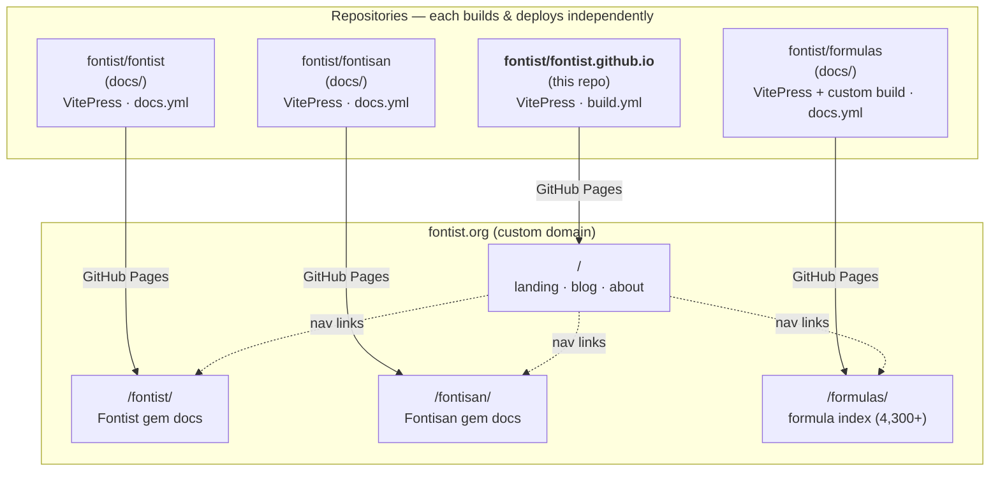

# Fontist Website

[](https://github.com/fontist/fontist.github.io/actions/workflows/build.yml)

This is the source for [fontist.org](https://www.fontist.org), built with [VitePress](https://vitepress.dev/). It is the **root** of a family of sites that together cover the Fontist project — this repo hosts the landing page, blog, and about pages, while each tool's documentation lives in its own repository and is deployed to a subpath of `fontist.org`.

## Site architecture

`fontist.org` is a **multi-repo, multi-site** setup. This repo (`fontist/fontist.github.io`) is the GitHub Pages **org site** that owns the `fontist.org` custom domain and is served at the apex (`/`). Each documentation subsite lives in its **own repository**, deploys its **own** GitHub Pages, and is served at `fontist.org/<repo>/` via GitHub Pages' project-page-under-custom-domain routing.



**How the routing works:** `fontist.github.io` owns the custom domain. Each subsite repo enables GitHub Pages with the same custom domain, so GitHub serves it at `fontist.org/<repo>/` — as long as this root repo does **not** publish content at those paths. Each subsite sets `base: "/<subsite>/"` in its VitePress config so generated asset/link paths include the subpath.

| Site | URL | Source repo | Default branch | Build entrypoint |
|---|---|---|---|---|
| Root (landing, blog, about) | `fontist.org/` | `fontist/fontist.github.io` *(this repo)* | `main` | `npm run build` |
| Fontist docs | `fontist.org/fontist/` | [`fontist/fontist`](https://github.com/fontist/fontist) (`docs/`) | `main` | `npm run build` *(in `docs/`)* |
| Fontisan docs | `fontist.org/fontisan/` | [`fontist/fontisan`](https://github.com/fontist/fontisan) (`docs/`) | `main` | `npm run build` *(in `docs/`)* |
| Formulas index | `fontist.org/formulas/` | [`fontist/formulas`](https://github.com/fontist/formulas) (`docs/`) | `v5` | `npm run build` *(in `docs/`, custom `build.js`)* |

> The Fontist GitHub Action ([`fontist/setup-fontist`](https://github.com/fontist/setup-fontist)) is a separate repo for CI/CD font installation and is not part of the docs site graph.

## Development

### This site (root)

```bash
npm install
npm run dev       # local dev server at http://localhost:5173
npm run build     # builds to .vitepress/dist (includes post-build "dirify" step)
npm run preview   # preview the production build
```

### Subsites

The subsites live in sibling repositories. Clone them alongside this repo:

```bash
git clone https://github.com/fontist/fontist.git  ../fontist
git clone https://github.com/fontist/fontisan.git ../fontisan
git clone https://github.com/fontist/formulas.git ../formulas
```

Then, from the subsite's `docs/` directory:

```bash
cd ../fontist/docs     # or ../fontisan/docs, ../formulas/docs
npm install
npm run dev            # local dev server
npm run build          # builds to docs/.vitepress/dist (+ post-build steps)
```

The `base` path defaults to the subsite's subpath (`/fontist/`, `/fontisan/`, `/formulas/`) via `process.env.BASE_PATH` in each subsite's `.vitepress/config.ts`, so a plain `npm run dev` works out of the box.

## Deployment

Every site deploys **automatically** when changes are pushed/merged to its default branch (`main`, or `v5` for formulas). There is nothing to deploy manually — open a PR in the relevant repo, merge it, and GitHub Pages handles the rest.

| Repo | Workflow | What it does |
|---|---|---|
| `fontist/fontist.github.io` | [`build.yml`](.github/workflows/build.yml) | build → verify → upload artifact → deploy to Pages |
| `fontist/fontist` | `docs.yml` | same pattern (runs in `docs/`) |
| `fontist/fontisan` | `docs.yml` | same pattern (runs in `docs/`) |
| `fontist/formulas` | `docs.yml` | batched build (4,300+ pages) → combine → deploy |

Each site builds to static HTML and deploys via `actions/upload-pages-artifact` + `actions/deploy-pages`.

## Adding blog posts

1. Create a new `.md` file in [`blog/`](blog/) with frontmatter (`title`, `description`, `authors`, optional `date`).
2. Add an entry to [`blog/index.md`](blog/index.md).

Blog posts get `BlogPosting` JSON-LD structured data automatically via the `transformHead` hook in [.vitepress/config.ts](.vitepress/config.ts).

## Conventions shared across all sites

For consistency, every site in the ecosystem follows these conventions. If you add a new site or change one, keep these aligned:

- **Per-page Open Graph / Twitter tags** — each site derives `og:title`, `og:description`, `og:url` from the page's frontmatter/H1 via a `transformHead` hook in `.vitepress/config.ts`, rather than using a single site-wide value.
- **Shared social card** — `og:image` points to `https://www.fontist.org/og-image.png` (PNG; SVG has poor support on Twitter/Facebook/LinkedIn).
- **`sitemap.xml` + `robots.txt`** — each site generates both. Subsites post-process the sitemap to insert their `base` path, because VitePress omits `base` from sitemap routes.
- **Directory-style URLs** — a post-build step (`scripts/post-build.mjs` here and in fontist/fontisan; custom `build.js` in formulas) converts `foo.html` → `foo/index.html` so both `/foo` and `/foo/` resolve on GitHub Pages (which otherwise 404s on the trailing slash for file routes).
- **Cross-site links carry `target="_self"`** (in `nav`/`sidebar` config) so VitePress's client-side router doesn't intercept same-origin clicks and render a client-side 404. Inline markdown links to other sites in the domain are auto-tagged `target="_blank"` by VitePress.

## See also

- [fontist/fontist](https://github.com/fontist/fontist) — the Fontist gem and its documentation.
- [fontist/fontisan](https://github.com/fontist/fontisan) — the Fontisan gem and its documentation.
- [fontist/formulas](https://github.com/fontist/formulas) — the formula registry and searchable index.
- [fontist/setup-fontist](https://github.com/fontist/setup-fontist) — the official GitHub Action for installing Fontist in CI.
